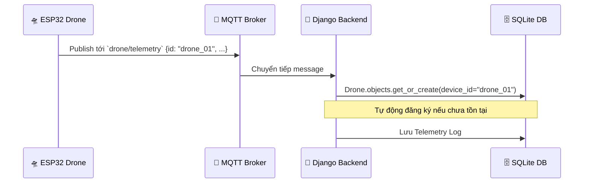
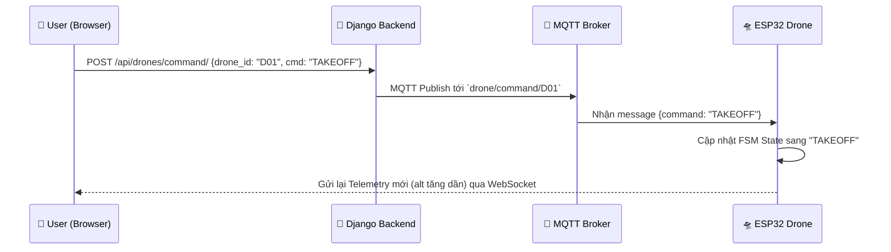

# 🏗️ Drone Management System Architecture

Tài liệu này giải thích kiến trúc hệ thống quản lý đa drone realtime, bao gồm cách thức giao tiếp, quản lý thiết bị và lập trình lộ trình.

---

## 📂 Cấu trúc thư mục (Folder Structure)

```text
├── backend-app/          # Backend (Django, Channels, MQTT Bridge)
│   ├── drones/           # Quản lý Drone, Mission & Waypoints
│   └── realtime/         # Xử lý WebSocket & MQTT Bridge
├── frontend-app/         # Dashboard (React, Tailwind, Leaflet)
├── esp32-firmware/       # Mã nguồn cho Drone thật/Giả lập (MicroPython)
├── infrastructure/       # Hạ tầng (Docker: Mosquitto MQTT Broker)
├── tools/                # Công cụ giả lập (Mock Drone Script)
└── walkthrough.md        # Hướng dẫn vận hành nhanh
```

---

## 🧩 Vai trò các thành phần

### 1. 🛠️ Drone (ESP32/Simulator)
Mỗi thiết bị (Drone) chạy một vòng lặp máy trạng thái (FSM):
-   **Định danh:** Mỗi drone có một `CLIENT_ID` duy nhất (ví dụ: `drone_01`, `drone_02`).
-   **Giao tiếp:** 
    -   Gửi Telemetry (GPS, Pin, Trạng thái) lên topic `drone/telemetry`.
    -   Lắng nghe lệnh điều khiển tại topic riêng: `drone/command/{CLIENT_ID}`.
-   **Logic di chuyển:** Hỗ trợ lệnh `TAKEOFF`, `LAND` và `GOTO (lat, lng)`. Khi nhận lộ trình, drone sẽ tự động tính toán hướng bay để di chuyển tới các tọa độ mục tiêu.

### 2. 📡 MQTT Broker (The Central Hub)
Sử dụng **Eclipse Mosquitto**. Đóng vai trò là "trung tâm thông tin":
-   Tất cả Drone và Backend đều kết nối tới đây.
-   Hỗ trợ hàng trăm drone kết nối đồng thời qua WiFi hoặc mạng công nghiệp.

### 3. 🧠 Backend App (The Brain)
-   **MQTT Bridge:** Nhận dữ liệu từ `drone/telemetry`, bóc tách `id` để cập nhật vào Database và đẩy lên WebSockets.
-   **Mission Manager:** Cung cấp API để lưu trữ các "Lộ trình" (danh sách tọa độ). Khi người dùng nhấn "Start Mission", backend sẽ gửi danh sách này xuống drone tương ứng.
-   **WebSockets:** Cập nhật vị trí của **tất cả** drone đang hoạt động lên giao diện người dùng theo thời gian thực.

### 4. 📊 Frontend Dashboard
-   **Multi-drone Support:** Sidebar cho phép theo dõi danh sách tất cả drone. Chọn 1 drone để xem chi tiết hoặc điều khiển.
-   **Mission Planner:** Tích hợp bản đồ Leaflet cho phép người dùng:
    1.  Nhấp chuột để tạo các điểm Waypoints.
    2.  Kéo thả để chỉnh sửa lộ trình.
    3.  Gửi lộ trình xuống Drone.

---

## 🔄 Luồng hoạt động chi tiết (System Workflows)

### 1. Quy trình thêm Drone mới (Auto-Discovery)
Hệ thống sử dụng cơ chế **Plug & Play**. Bạn không cần đăng ký drone trước thủ công.



### 2. Luồng Điều khiển (Control Flow)
Khi bạn bấm nút "Takeoff" hoặc "Land" trên giao diện web:



**Chi tiết kỹ thuật:**
1.  **Frontend:** Gửi HTTP POST request chứa ID của drone và loại lệnh.
2.  **Backend:** Sử dụng thư viện `paho-mqtt` để đẩy lệnh xuống Topic tương ứng với Drone đó.
3.  **Drone:** Đang `subscribe` topic lệnh của chính nó. Khi nhận được, nó thực thi logic phần cứng (hoặc giả lập) ngay lập tức.

### 3. Luồng cập nhật Real-time (Telemetry Flow)
Để bản đồ luôn mượt mà, dữ liệu đi qua 4 chặng:

1.  **Chặng 1 (IoT):** Drone gửi tọa độ qua MQTT mỗi 1-2 giây.
2.  **Chặng 2 (Bridge):** Script `mqtt_listener.py` trong backend luôn chạy ngầm để "hứng" dữ liệu này.
3.  **Chặng 3 (Broadcast):** Backend dùng **Django Channels** để "phát thanh" dữ liệu đó qua WebSocket Group `drone_updates`.
4.  **Chặng 4 (Render):** React hook `useDroneSocket` nhận dữ liệu và cập nhật `state` của React, khiến drone trên bản đồ di chuyển.

---

## 🛠️ Công nghệ sử dụng (Tech Stack)

-   **Ngôn ngữ:** Python (Backend), JavaScript (Frontend), MicroPython (Firmware).
-   **Giao thức:** MQTT (IoT), WebSockets (Realtime Web).
-   **Framework:** Django (Core), React (UI), Leaflet (Map).
-   **Giả lập:** ESP32 chip hoặc Python script giả lập giao thức MQTT.
