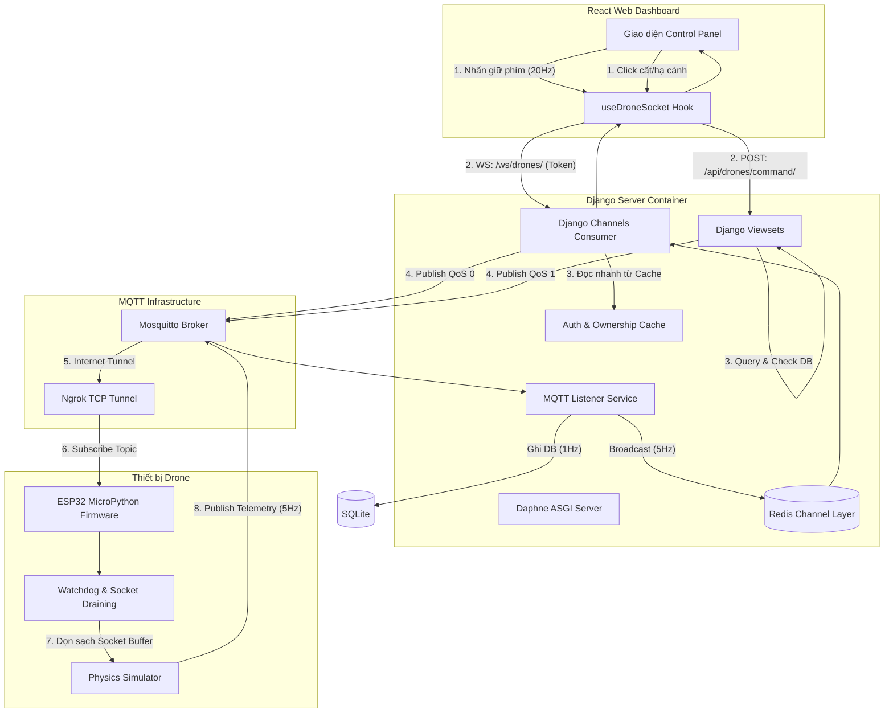
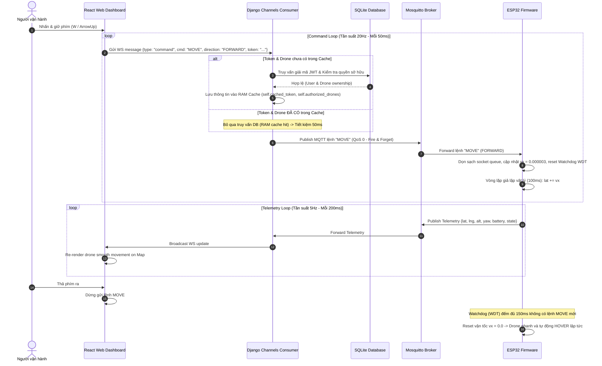
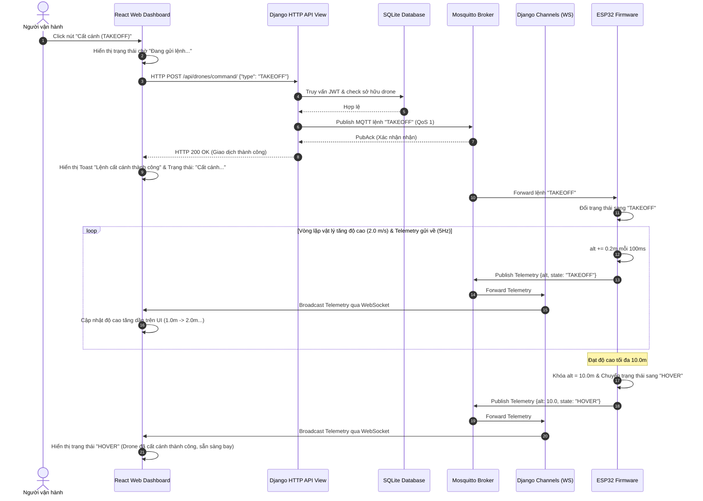
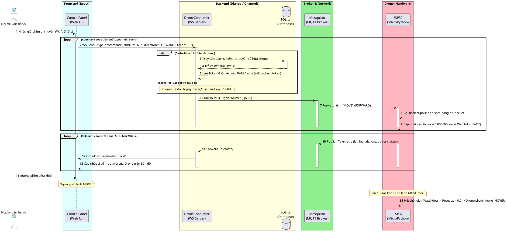
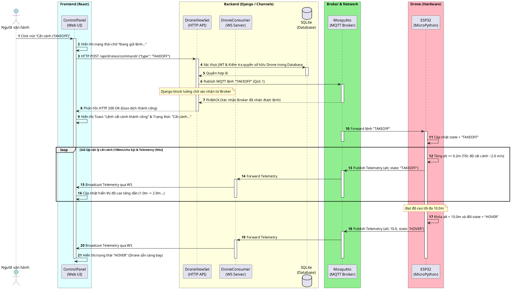

# Tài liệu Kiến trúc & Cơ chế Điều khiển Drone Thời gian thực

Tài liệu này thuyết minh chi tiết về thiết kế hệ thống, luồng truyền thông điệp, mô hình giả lập vật lý, và các giải pháp tối ưu hóa giảm độ trễ (latency) cho chức năng điều khiển Drone thời gian thực trong dự án.

---

## Giới thiệu Chức năng chính của Hệ thống

Hệ thống điều khiển Drone thời gian thực cung cấp giải pháp toàn diện từ phần cứng (ESP32) đến phần mềm (Django Backend & React Frontend) nhằm thực thi các chức năng sau:

1. **Theo dõi trạng thái thời gian thực (Real-time Telemetry Tracking):**
   * Drone tự động phát và cập nhật liên tục các thông số trạng thái quan trọng: Tọa độ địa lý (Kinh độ, Vĩ độ), Độ cao hiện tại (Altitude), Hướng quay đầu (Yaw), dung lượng Pin (Battery %) và Trạng thái bay (`IDLE`, `TAKEOFF`, `HOVER`, `LANDING`, `MOVING`).
   * Tần suất cập nhật đạt **5Hz (200ms/lần)** giúp hiển thị vị trí drone trơn tru, không bị giật cục trên bản đồ Web Dashboard.

2. **Cất cánh và Hạ cánh tự động (Auto Takeoff / Landing):**
   * **Cất cánh tự động:** Chỉ với 1 nút bấm, drone khởi động động cơ, cất cánh tuyến tính với tốc độ **2.0 m/s** và tự động khóa độ cao, chuyển sang trạng thái bay đứng im (`HOVER`) khi đạt độ cao an toàn mục tiêu là **10.0m**.
   * **Hạ cánh an toàn:** Drone tự động tính toán hạ độ cao thông minh. Khi ở trên cao, drone hạ nhanh với tốc độ **1.5 m/s**. Khi cách mặt đất dưới **1.5m**, hệ thống tự động kích hoạt chế độ giảm tốc tiếp đất chỉ còn **0.5 m/s** nhằm triệt tiêu lực va đập vật lý trước khi tắt hẳn động cơ về trạng thái nghỉ (`IDLE`).

3. **Điều khiển thủ công thời gian thực (Manual Keyboard Flight Control):**
   * Hỗ trợ người dùng lái drone bằng bàn phím máy tính thông qua các tổ hợp phím trực quan (`W`, `A`, `S`, `D` để di chuyển; `Q`, `E` để xoay hướng; `Shift`, `Space` để thay đổi độ cao).
   * Cơ chế **điều khiển dựa trên vận tốc** cho phép drone tăng tốc mượt mà, phản hồi lập tức và dừng lại ngay khi thả phím (không bị trôi quán tính hay trễ hàng đợi mạng).

4. **Bay tự động tới điểm chỉ định (GOTO Coordinates):**
   * Người dùng có thể click chọn vị trí trên bản đồ Web Dashboard, hệ thống tự động gửi tọa độ mục tiêu đến drone để drone tự động di chuyển đến điểm đích và chuyển sang trạng thái đứng im (`HOVER`).

5. **Dừng khẩn cấp (Emergency Stop):**
   * Cơ chế bảo vệ phần cứng lập tức tắt mọi tín hiệu điều khiển động cơ và khởi động lại vi điều khiển ESP32 ngay khi nhận được tín hiệu khẩn cấp từ người vận hành để phòng tránh va chạm nghiêm trọng.

---

## 1. Sơ đồ Kiến trúc Hệ thống (System Architecture)

Hệ thống được thiết kế theo mô hình lai (Hybrid Control Architecture), kết hợp giữa kết nối **WebSocket** (để truyền dữ liệu điều khiển thời gian thực với độ trễ thấp nhất) và **HTTP API** (cho các lệnh cấu hình quan trọng cần đảm bảo độ tin cậy giao dịch).



---

## 2. Luồng Truyền Thông điệp (Message Flow) & Phân loại Giao thức

Hệ thống phân chia các tập lệnh điều khiển thành hai kênh truyền dẫn khác nhau tùy thuộc vào yêu cầu của lệnh:

| Thuộc tính | Kênh Thời gian thực (WebSocket - WS) | Kênh Giao dịch Cấu hình (HTTP API) |
| :--- | :--- | :--- |
| **Các lệnh áp dụng** | `MOVE` (Tiến/Lùi/Trái/Phải), `CLIMB`, `DESCEND`, `YAW_LEFT`, `YAW_RIGHT` | `TAKEOFF` (Cất cánh), `LAND` (Hạ cánh), `EMERGENCY` (Dừng khẩn), `GOTO` (Tọa độ chỉ định) |
| **Giao thức truyền** | WebSocket TCP -> MQTT QoS 0 (Fire & Forget) | HTTP POST -> Django View -> MQTT QoS 1 (At least once) |
| **Độ trễ xử lý** | **~1ms - 5ms** | ~30ms - 100ms |
| **Xác thực quyền** | Sử dụng token JWT cache trong bộ nhớ RAM của WebSocket Consumer (Bỏ qua DB) | Xác thực thông qua Middleware JWT chuẩn của Django (Truy vấn database liên tục) |
| **Mục đích** | Truyền tải liên tục khi bấm giữ phím để drone di chuyển mượt mà nhất. | Đảm bảo tính toàn vẹn của lệnh điều khiển bay cơ bản, không được phép thất thoát. |

### Chi tiết thiết kế Kiến trúc lai (Hybrid Architecture Rationale)

Việc chia nhỏ thành hai luồng truyền dẫn độc lập nhằm giải quyết mâu thuẫn giữa **Độ trễ tối thiểu (Low Latency)** và **Độ tin cậy tối đa (High Reliability)** trong điều khiển Drone:

#### A. Kênh Điều khiển Thời gian thực (WebSocket & MQTT QoS 0)
* **Bản chất luồng dữ liệu:** Đây là luồng truyền tải liên tục (Streaming) các gói tin điều khiển hướng và vận tốc với tần suất cực cao (mỗi 50ms khi giữ phím).
* **Đặc tính truyền nhận:** Luồng này ưu tiên **tốc độ phản hồi tức thời**. Nếu một vài gói tin bị mất mát trên đường truyền Internet, hệ thống vẫn hoạt động bình thường vì gói tin tiếp theo sẽ ghi đè vận tốc mới ngay sau đó 50ms. 
* **Tối ưu hóa xử lý:**
  * Client thiết lập một kết nối WebSocket duy nhất, duy trì lâu dài với Daphne (ASGI Server).
  * Lệnh di chuyển gửi qua WS được Django Consumer xử lý trực tiếp trên RAM, bỏ qua truy vấn SQLite Database.
  * MQTT Broker sử dụng cơ chế truyền **QoS 0 (Fire and Forget - Gửi và Quên)**: Broker nhận lệnh từ Django và chuyển tiếp ngay lập tức sang ESP32 mà không cần chờ đợi phản hồi xác nhận nhận (Ack) từ chip. Điều này giảm thiểu thời gian chiếm giữ luồng TCP xuống dưới **5ms**.

#### B. Kênh Giao dịch Cấu hình (HTTP API & MQTT QoS 1)
* **Bản chất luồng dữ liệu:** Đây là các lệnh thay đổi trạng thái gốc mang tính sống còn đối với sự an toàn của Drone như cất cánh (`TAKEOFF`), hạ cánh tiếp đất (`LAND`) hoặc dừng khẩn cấp ngắt điện động cơ (`EMERGENCY`).
* **Đặc tính truyền nhận:** Yêu cầu **độ tin cậy tuyệt đối (100% Delivery)**. Một lệnh cất cánh bị thất lạc sẽ khiến drone nằm yên tại chỗ trong khi người vận hành cho rằng nó đã cất cánh; nghiêm trọng hơn, lệnh hạ cánh bị mất có thể dẫn đến việc drone cạn kiệt pin và rơi tự do.
* **Quy trình xử lý chuẩn hóa:**
  * Lệnh được gửi dưới dạng yêu cầu **HTTP POST API** truyền thống. Mỗi yêu cầu đều bắt buộc phải đi qua hệ thống Middleware xác thực JWT của Django, lưu nhật ký hoạt động (Audit Logs) vào cơ sở dữ liệu SQLite để phục vụ công tác giám sát.
  * Django sử dụng kết nối MQTT ở cấu hình **QoS 1 (At least once - Đảm bảo nhận ít nhất một lần)**. Khi Django publish lệnh `TAKEOFF`, nó sẽ chặn (block) luồng xử lý nhẹ để đợi gói tin xác nhận `PUBACK` từ MQTT Broker.
  * Chỉ khi nhận được `PUBACK` khẳng định lệnh đã nằm chắc chắn trong hàng đợi của Broker, Django mới trả về phản hồi `HTTP 200 OK` cho Frontend. Điều này đảm bảo an toàn tuyệt đối trước khi cập nhật giao diện người dùng.

---

### B. Biểu đồ Sequence Diagram chi tiết

Dưới đây là Sequence Diagram mô tả chi tiết 2 luồng hoạt động chính của chức năng điều khiển Drone:

#### 1. Luồng Điều khiển thủ công thời gian thực (Manual Steering via WebSocket)



#### 2. Luồng Cất cánh / Hạ cánh tự động (Takeoff/Landing via HTTP API)



---

## 3. Các kỹ thuật Tối ưu hóa Giảm độ trễ (Latency Optimizations)

Để đảm bảo drone phản hồi ngay lập tức (real-time) và dừng ngay khi người dùng buông phím điều khiển, hệ thống đã được tối ưu hóa sâu tại hai đầu:

### A. Phía Django Backend: Bộ đệm xác thực kết nối (Authentication & Ownership Cache)
Trong các hệ thống Django truyền thống, mỗi gói tin gửi lên từ Client đều phải trải qua quá trình giải mã token JWT và truy vấn cơ sở dữ liệu (`SELECT auth_user` và `SELECT drones_drone`) để kiểm tra quyền sở hữu. 
* **Vấn đề:** Khi người dùng giữ phím, Web gửi lệnh liên tục ở tần số **20Hz (50ms/lần)**. Việc thực hiện 40 truy vấn database mỗi giây sẽ nhanh chóng làm cạn kiệt thread pool và gây tắc nghẽn, dẫn đến độ trễ phản hồi lên tới 1-2 giây.
* **Giải pháp:** Caching thông tin xác thực trên đối tượng Kết nối WebSocket (`self` của Consumer):
  1. Khi nhận gói tin đầu tiên, hệ thống xác thực token và quyền kiểm tra sở hữu drone từ Database rồi lưu vào RAM: `self.authenticated_user` và `self.authorized_drones`.
  2. Các gói tin tiếp theo cùng kết nối sẽ bỏ qua hoàn toàn Database, đọc trực tiếp trạng thái xác thực từ bộ nhớ RAM.
  3. Độ trễ xác thực giảm từ **~50ms xuống < 0.1ms**.

### B. Phía ESP32 Firmware: Triệt tiêu trễ tích lũy bằng uselect.poll() (Socket Draining)
* **Vấn đề (Queue Lag):** ESP32 chạy vòng lặp chính ở tần số **10Hz (100ms/lần)** do có lệnh dừng `time.sleep(0.1)` để ổn định cảm biến và phần cứng. Do đó, tốc độ xử lý gói tin của ESP32 (10Hz) chậm hơn tốc độ gửi của Web (20Hz). Sau khi bấm giữ phím 10 giây, hàng đợi TCP buffer của ESP32 bị dồn ứ khoảng 100 gói tin. Khi người dùng nhả phím, drone vẫn tiếp tục tự bay thêm 10 giây nữa để xử lý nốt hàng đợi.
* **Giải pháp:** Sử dụng cơ chế Polling phi chặn để đọc cạn kiệt socket buffer ở đầu mỗi chu kỳ lặp:
  ```python
  import uselect
  # Đăng ký socket vào bộ lọc polling
  poller = uselect.poll()
  poller.register(client.sock, uselect.POLLIN)
  
  # Trong vòng lặp chính (100ms):
  while poller.poll(0): # Đọc sạch toàn bộ gói tin đang chờ trong hàng đợi
      client.check_msg()
  ```
  Nhờ cơ chế này, toàn bộ gói tin dồn ứ sẽ được ESP32 giải quyết sạch sẽ chỉ trong `< 1ms` tại đầu chu kỳ. Khi buông phím, hàng đợi trống rỗng, drone dừng lại **ngay lập tức**.

---

## 4. Cơ chế Tính toán & Giả lập Vật lý Bay (Flight Physics & Calculation Mechanics)

Để hành vi của Drone trên bản đồ giống ngoài đời thực nhất, chương trình giả lập trên ESP32 tích hợp các mô hình tính toán động học và động lực học bay sau:

### A. Mô hình Tích phân Vận tốc (Velocity-based Motion Integration)
Khi nhận lệnh điều khiển thủ công di chuyển (`MOVE`) hoặc xoay đầu (`YAW`), vi điều khiển ESP32 không thay đổi trực tiếp tọa độ (tránh hiện tượng dịch chuyển tức thời gây giật màn hình). Thay vào đó, nó thực hiện tích phân số học (numerical integration) theo bước thời gian thực thi của vòng lặp ($\Delta t = 100\text{ ms}$):

#### 1. Công thức cập nhật Tọa độ Địa lý (Kinh vĩ độ)
Tọa độ được tính toán dựa trên các thành phần vận tốc trục $v_x$ (vĩ độ) và $v_y$ (kinh độ):
$$\text{lat}_{t+1} = \text{lat}_{t} + v_x$$
$$\text{lng}_{t+1} = \text{lng}_{t} + v_y$$

* **Tham số tốc độ di chuyển thủ công:** 
  * Bước di chuyển mỗi chu kỳ ($step`) được cấu hình cố định là: $0.000003$ đơn vị tọa độ địa lý.
  * Tốc độ thực tế ước tính: 
    $$\text{Vận tốc} \approx 0.000003 \times 111,320\text{ m/độ} \approx 0.33\text{ m/100ms} \approx 3.3\text{ m/s}$$
  * Khi người dùng nhả phím, vận tốc $v_x, v_y$ được phanh về $0.0$ giúp drone dừng lại tại chỗ.

#### 2. Công thức tích phân góc hướng đầu (Yaw Angle)
Góc quay đầu (hướng mũi drone so với trục Bắc) được tính bằng tích phân vận tốc góc $v_{\text{yaw}}$ kết hợp phép chia lấy dư vòng tròn ($360^\circ$):
$$\text{yaw}_{t+1} = (\text{yaw}_{t} + v_{\text{yaw}}) \pmod{360}$$

* **Tham số tốc độ xoay góc:**
  * Vận tốc xoay mặc định: $v_{\text{yaw}} = \pm 4.0^\circ$ mỗi chu kỳ $100\text{ ms}$.
  * Tốc độ thực tế: $\approx 40^\circ\text{/giây}$.

---

### B. Thuật toán kiểm soát Độ cao cất/hạ cánh tự động (Smart Altitude Management)
Thuật toán kiểm soát độ cao tự động mô phỏng các giai đoạn bay an toàn dựa trên hàm rời rạc theo thời gian:

#### 1. Pha Cất cánh tự động (TAKEOFF Phase)
* Vận tốc bay lên định mức: $v_z = +0.2\text{ m}$ mỗi $100\text{ ms}$ (tương đương $2.0\text{ m/s}$).
* Công thức cập nhật độ cao:
  $$\text{alt}_{t+1} = \min(\text{alt}_{t} + 0.2, 10.0)$$
* **Giới hạn biên an toàn:** Khi độ cao chạm ngưỡng tối đa $10.0\text{ m}$, hệ thống kích hoạt bộ hãm khóa cứng giá trị $\text{alt} = 10.0\text{ m}$ nhằm triệt tiêu hoàn toàn sai số tích lũy của phép cộng số thực (`float`), đồng thời tự động chuyển trạng thái Drone sang `HOVER` (Bay đứng im).

#### 2. Pha Hạ cánh tự động (LANDING Phase)
Để chống va đập vật lý phá hủy drone khi tiếp đất, tốc độ hạ cánh được thiết kế thành một đường cong giảm tốc 2 giai đoạn:
* **Giai đoạn 1 (Hạ độ cao nhanh - Độ cao $> 1.5\text{ m}$):** Tốc độ hạ cánh là $1.5\text{ m/s}$ (giảm $0.15\text{ m}$ mỗi $100\text{ ms}$):
  $$\text{alt}_{t+1} = \text{alt}_{t} - 0.15$$
* **Giai đoạn 2 (Tiếp đất êm ái - Độ cao $< 1.5\text{ m}$):** Tốc độ tự động hãm phanh chậm lại chỉ còn $0.5\text{ m/s}$ (giảm $0.05\text{ m}$ mỗi $100\text{ ms}$) để tiếp đất nhẹ nhàng nhất:
  $$\text{alt}_{t+1} = \text{alt}_{t} - 0.05$$
* **Ngắt động cơ:** Khi $\text{alt} \le 0.0\text{ m}$, độ cao được khóa cứng bằng $0.0\text{ m}$ và chuyển đổi trạng thái về `IDLE` (Nghỉ).

---

### C. Cơ chế Watchdog phanh tự động (WDT Timer Control)
Để ngăn ngừa tình trạng mất kết nối mạng giữa chừng khiến drone tiếp tục bay tự do theo vận tốc cũ (mất kiểm soát), ESP32 duy trì một bộ định thời Watchdog WDT bằng phần mềm cho từng trục chuyển động:
* Mỗi khi nhận được lệnh điều khiển tương ứng (`MOVE`, `CLIMB`, `YAW`), hệ thống ghi lại mốc thời gian nhận tin bằng hàm `time.ticks_ms()` vào biến `last_update`.
* Tại mỗi chu kỳ lặp động học ($100\text{ ms}$), hệ thống so sánh:
  $$\text{ticks\_diff}(\text{time.ticks\_ms}(), \text{last\_update}) > 150\text{ ms}$$
* Nếu điều kiện trên đúng (quá 3 chu kỳ gửi lệnh của Web mà không có lệnh mới), hệ thống tự động gán các vận tốc mục tiêu về $0.0$:
  $$v_x = 0.0, \quad v_y = 0.0, \quad v_z = 0.0, \quad v_{\text{yaw}} = 0.0$$
  Ép drone dừng chuyển động và chuyển sang chế độ bay đứng yên (`HOVER`).

---

### D. Chu kỳ gửi Telemetry tần số cao (5Hz)
Để chỉ số độ cao và vị trí trên Web cập nhật liên tục mà không làm ảnh hưởng đến tốc độ tính toán vật lý, luồng Telemetry sử dụng bộ đếm mili-giây phi chặn:
```python
now = time.ticks_ms()
if time.ticks_diff(now, last_send) >= 200:
    client.publish(TOPIC_TELEMETRY, json.dumps(telemetry))
    last_send = now
```
* **Ý nghĩa:** Tần suất gửi Telemetry đạt $5\text{ Hz}$ ($200\text{ ms}$ một lần). Tốc độ này khớp tối ưu với khả năng cập nhật của giao diện Web React và giảm tải băng thông mạng so với việc gửi ở tần số $10\text{ Hz}$ của vòng lặp động học.

---

## 5. Hướng dẫn Điều khiển bằng Bàn phím (Keyboard Control Map)

Khi mở bảng điều khiển (`ControlPanel`) của một drone đã online trên Web Dashboard, bạn có thể sử dụng bàn phím máy tính để điều khiển trực tiếp với sơ đồ phím sau:

| Phím bấm | Lệnh gửi đi | Mô tả hành động của Drone |
| :--- | :--- | :--- |
| **`W`** / **`↑`** | `MOVE` (FORWARD) | Bay tiến về phía trước (Tăng vĩ độ `lat` với tốc độ `3.0 m/s`) |
| **`S`** / **`↓`** | `MOVE` (BACKWARD) | Bay lùi về phía sau (Giảm vĩ độ `lat`) |
| **`A`** / **`←`** | `MOVE` (LEFT) | Bay nghiêng sang trái (Giảm kinh độ `lng`) |
| **`D`** / **`→`** | `MOVE` (RIGHT) | Bay nghiêng sang phải (Tăng kinh độ `lng`) |
| **`Q`** | `YAW_LEFT` | Xoay đầu sang trái (Góc hướng đầu `yaw` giảm với tốc độ `40°/s`) |
| **`E`** | `YAW_RIGHT` | Xoay đầu sang phải (Góc hướng đầu `yaw` tăng với tốc độ `40°/s`) |
| **Shift** | `CLIMB` | Tăng độ cao thủ công (Tốc độ `1.0 m/s` hướng lên) |
| **Space** | `DESCEND` | Giảm độ cao thủ công (Tốc độ `1.0 m/s` hướng xuống) |

---

## 6. Mã nguồn PlantUML của 2 Luồng Điều khiển

Để tạo sơ đồ Sequence Diagram dưới định dạng ảnh chất lượng cao hoặc chèn vào tài liệu báo cáo khác, dưới đây là mã nguồn của 2 luồng hoạt động chính được tách riêng biệt để bạn tải/up lên công cụ [PlantText](https://www.planttext.com/) hoặc [PlantUML Server](https://www.plantuml.com/plantuml/):

### A. Luồng 1: Điều khiển thủ công thời gian thực (WebSocket & MQTT QoS 0)



### B. Luồng 2: Cất cánh / Hạ cánh tự động (HTTP API POST & MQTT QoS 1)



### Mô tả chi tiết Luồng hoạt động (Sequence Diagram Breakdown)

#### Luồng 1: Điều khiển thủ công thời gian thực (Real-time Manual Steering)
1. **Bắt đầu phím giữ:** Khi người dùng nhấn và giữ các phím định hướng trên bàn phím (`W`, `A`, `S`, `D`), vòng lặp điều khiển ở Frontend được kích hoạt với chu kỳ 50ms (20Hz).
2. **Gửi lệnh cực nhanh qua WS:** Frontend liên tục gửi tin nhắn WebSocket đến máy chủ ASGI (Daphne). Tin nhắn chứa token JWT và lệnh di chuyển.
3. **Cơ chế Cache loại bỏ nghẽn:** 
   * Tại Django, lớp `DroneConsumer` bắt và phân tích gói tin. 
   * Ở lần gửi đầu tiên (Cache Miss), nó thực hiện truy cập cơ sở dữ liệu SQLite thông qua ORM để giải mã JWT và xác thực quyền sở hữu thiết bị của User. Sau đó lưu vào RAM Cache.
   * Ở tất cả các lần gửi tiếp theo (Cache Hit), Django bỏ qua hoàn toàn cơ sở dữ liệu, cho phép luồng thực thi đi tiếp ngay lập tức, triệt tiêu thời gian phản hồi DB.
4. **Publish MQTT QoS 0:** Lệnh sau khi xác thực được gửi trực tiếp đến Mosquitto Broker với chất lượng dịch vụ QoS 0 (gửi không cần xác nhận nhận) và chuyển tiếp tới ESP32 nhằm giảm tối đa độ trễ.
5. **ESP32 dọn dẹp bộ đệm:** ESP32 đón nhận tin nhắn MQTT. Thông qua thư viện `uselect.poll()`, nó dọn sạch toàn bộ socket buffer đang bị trễ để cập nhật trạng thái mới nhất ngay lập tức. Vận tốc mục tiêu `vx` được gán bằng `0.000003` và Watchdog WDT được reset liên tục.
6. **Mô phỏng chuyển động:** Vòng lặp giả lập (100ms) tính toán tọa độ mới bằng cách cộng dồn `lat += vx`.
7. **Telemetry phản hồi:** Định kỳ mỗi 200ms (5Hz), ESP32 phát gói telemetry chứa tọa độ mới lên Broker MQTT. Broker gửi tiếp về Django và chuyển phát nhanh lên giao diện qua kênh WebSocket để render vị trí mượt mà trên bản đồ.
8. **Phanh tự động:** Khi người dùng thả tay, luồng phát lệnh ngừng lại. ESP32 phát hiện 150ms trôi qua không có gói tin di chuyển mới sẽ tự động đặt `vx = 0.0` để dừng và đưa Drone vào trạng thái giữ độ cao (`HOVER`).

#### Luồng 2: Cất cánh / Hạ cánh tự động (Auto Takeoff / Landing)
1. **Lệnh đơn quan trọng:** Người dùng kích hoạt các nút hành động dạng đơn lẻ (`TAKEOFF`, `LAND`, `EMERGENCY`).
2. **POST API tin cậy:** Yêu cầu được gửi dưới dạng HTTP POST request thông qua Django API Endpoint chuẩn.
3. **Xác thực chính quy:** Django thực hiện giải mã JWT, kiểm tra toàn vẹn tài khoản và đối chiếu cơ sở dữ liệu SQLite một cách chính quy nhất để tránh các sai lệch an ninh mạng.
4. **Publish MQTT QoS 1:** Django Channels kết nối với Mosquitto Broker qua giao thức tin cậy QoS 1. Giao thức này bắt buộc Broker gửi về gói tin xác nhận `PUBACK` sau khi lưu trữ thành công thông điệp trong Broker. Django chặn luồng đợi gói tin này để đảm bảo lệnh cất cánh không bao giờ bị thất lạc giữa chừng.
5. **Phản hồi 200 OK:** Web Dashboard nhận được HTTP status 200 OK thông báo giao dịch thiết lập lệnh thành công.
6. **ESP32 nhận lệnh và bay:** ESP32 chuyển đổi trạng thái sang `TAKEOFF` (hoặc `LANDING`). Vòng lặp vật lý tự động điều chỉnh tăng độ cao `alt += 0.2m` mỗi 100ms (tương đương 2.0 m/s).
7. **Khóa độ cao:** Khi độ cao chạm ngưỡng `10.0m`, bộ giới hạn biên khóa giá trị và tự động chuyển trạng thái của drone sang `HOVER` an toàn.
