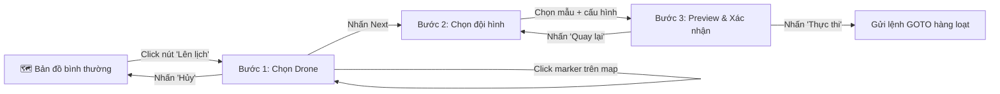

# Kế hoạch triển khai: Formation Scheduler (Lên lịch đội hình bay)

## Mục tiêu

Cho phép người dùng chọn nhiều drone trên bản đồ, chọn một mẫu đội hình bay (bay thẳng, xếp chữ, bay vòng tròn...), xem preview kết quả trên bản đồ, rồi gửi lệnh GOTO hàng loạt xuống các drone.

## Luồng UX (Wizard 3 bước)



### Bước 1 — Chọn Drone
- Nhấn nút **"📋 Lên lịch"** ở góc trên trái bản đồ → bật chế độ chọn drone.
- Click vào marker drone trên map → drone được highlight (viền vàng) và thêm vào danh sách.
- Panel bên trái hiển thị **danh sách drone đã chọn** với:
  - Checkbox từng drone (bỏ chọn riêng lẻ).
  - Nút **"Chọn tất cả"** / **"Bỏ chọn tất cả"**.
  - Hiển thị trạng thái (Online/Offline, Pin).
- Chỉ drone **Online** mới được chọn.
- Nhấn **"Next →"** để sang bước 2 (disable nếu chưa chọn drone nào).

### Bước 2 — Chọn đội hình
- Hiển thị danh sách các mẫu đội hình dưới dạng **card grid**, mỗi card có:
  - **Icon/Preview nhỏ** minh họa đội hình (hình SVG tĩnh).
  - Tên đội hình.
  - Yêu cầu **số drone tối thiểu** (ví dụ: "Tối thiểu 3 drone").
  - Card bị **disable + greyed out** nếu số drone đã chọn không đủ.
- Các mẫu đội hình:

| Mẫu | Mô tả | Drone tối thiểu | Tham số cấu hình |
|---|---|---|---|
| **Bay thẳng hàng** | Dàn drone thành 1 hàng ngang hoặc dọc | 2 | Hướng (Ngang/Dọc), Khoảng cách giữa các drone |
| **Bay vòng tròn** | Xếp drone thành vòng tròn | 3 | Bán kính, Tâm (click trên map) |
| **Xếp lưới** | Dàn drone thành ô lưới hình chữ nhật | 4 | Số cột, Khoảng cách |
| **Xếp chữ** | Bay tạo hình chữ cái trên trời | Tùy chữ (hiển thị khi nhập) | Ký tự cần xếp (A-Z, 0-9), Kích thước |

- Khi chọn mẫu → hiện form cấu hình tham số tương ứng.
- Nhấn **"Xem trước →"** để sang bước 3.

### Bước 3 — Preview & Xác nhận
- Bản đồ hiển thị:
  - **Marker drone hiện tại** (vị trí thực).
  - **Ghost marker** (vị trí đích dự kiến) bằng marker mờ + đường nét đứt nối từ vị trí hiện tại → vị trí đích.
- Panel hiển thị tóm tắt: Số drone, Đội hình đã chọn, Tham số.
- Nút **"🚀 Thực thi"** → gửi lệnh. Nút **"← Quay lại"** → về bước 2.

---

## Các file cần tạo/sửa

### Frontend

#### [NEW] `src/components/FormationScheduler.jsx`
Component wizard chính, quản lý state qua 3 bước:
- **State:** `step` (1/2/3), `selectedDrones[]`, `selectedPattern`, `patternConfig{}`.
- **Step 1:** Render danh sách drone với checkbox, nút chọn tất cả.
- **Step 2:** Render grid các mẫu đội hình (card). Disable card nếu thiếu drone. Khi chọn → hiện form cấu hình.
- **Step 3:** Gọi hàm tính tọa độ từ `FormationPatterns.js`, truyền kết quả cho `MapView` để vẽ ghost markers. Nút thực thi gọi API gửi lệnh.

#### [NEW] `src/utils/FormationPatterns.js`
Thư viện thuần JS tính toán tọa độ đội hình. Mỗi hàm nhận danh sách drone (với vị trí hiện tại) + tham số cấu hình → trả về mảng `[{ droneId, targetLat, targetLng }]`.

```js
// API của mỗi hàm:
lineFormation(drones, centerLat, centerLng, direction, spacing)
// → Dàn hàng ngang/dọc từ tâm

circleFormation(drones, centerLat, centerLng, radiusMeters)
// → Phân bố đều trên đường tròn

gridFormation(drones, originLat, originLng, columns, spacingMeters)
// → Xếp lưới hình chữ nhật

textFormation(drones, text, centerLat, centerLng, scaleMeters)
// → Trả về { positions, minDronesRequired }
// Dùng font bitmap 5x7 đơn giản (A-Z, 0-9) để tính tọa độ các điểm
```

> [!NOTE]
> Chuyển đổi khoảng cách (mét) sang độ GPS: `1 mét ≈ 0.000009 độ lat`, `1 mét ≈ 0.0000115 độ lng` (tại vĩ độ ~21°N Hà Nội).

#### [MODIFY] `src/components/MapView.jsx`
Thêm 2 tính năng khi ở chế độ Formation:
1. **Chế độ chọn drone:** Khi prop `selectionMode=true`, click marker → gọi `onDroneSelect(droneId)` thay vì mở Popup. Drone đã chọn → marker có viền vàng nhấp nháy.
2. **Ghost markers:** Khi nhận prop `ghostPositions=[{droneId, lat, lng}]`, vẽ marker mờ (opacity 0.4) tại vị trí đích + đường nét đứt (Polyline dashed) nối từ vị trí hiện tại.

#### [MODIFY] `src/App.jsx`
- Thêm state: `formationMode` (boolean), `selectedDrones` (array), `ghostPositions` (array).
- Khi `activeTab === 'map'`:
  - Render nút **"📋 Lên lịch"** ở góc trên trái (nếu chưa bật formation mode).
  - Khi bật → render `<FormationScheduler>` thay cho `<ControlPanel>`.
  - Truyền `selectionMode` và `ghostPositions` xuống `<MapView>`.

---

### Backend (Django)

#### [MODIFY] `drones/views.py`
Thêm action `formation` trong `DroneViewSet`:

```python
@action(detail=False, methods=['post'])
def formation(self, request):
    """
    Nhận danh sách drone + tọa độ đích đã tính sẵn từ Frontend.
    Body: { "targets": [{ "drone_id": "abc", "lat": 20.98, "lng": 105.79 }, ...] }
    Gửi lệnh GOTO hàng loạt xuống MQTT.
    """
    targets = request.data.get('targets', [])
    for t in targets:
        topic = f"drone/{t['drone_id']}/command"
        payload = json.dumps({
            "type": "GOTO",
            "params": {"lat": t["lat"], "lng": t["lng"]}
        })
        publish.single(topic, payload, hostname=os.getenv('MQTT_HOST', 'localhost'))
    return Response({"status": f"Formation sent to {len(targets)} drones"})
```

#### [MODIFY] `drones/urls.py`
Không cần sửa thủ công — `DroneViewSet` dùng Router nên action `formation` tự động có route:
`POST /api/drones/formation/`

---

### Firmware (ESP32)

> [!TIP]
> **Không cần sửa firmware.** Drone đã hỗ trợ lệnh `GOTO(lat, lng)` tại [main.py:L60-65](file:///d:/N4_HK2/emb.sys-btl/esp32-firmware/main.py#L60-L65). Backend chỉ cần gửi đúng format là drone sẽ bay đến vị trí đích.

---

## Thứ tự triển khai

| # | Việc cần làm | File |
|---|---|---|
| 1 | Tạo thư viện tính tọa độ đội hình | `src/utils/FormationPatterns.js` |
| 2 | Sửa MapView: thêm chế độ chọn drone + ghost markers | `src/components/MapView.jsx` |
| 3 | Tạo component FormationScheduler (wizard 3 bước) | `src/components/FormationScheduler.jsx` |
| 4 | Sửa App.jsx: tích hợp Formation mode | `src/App.jsx` |
| 5 | Thêm API endpoint formation ở Backend | `drones/views.py` |
| 6 | Test toàn bộ với mock_drone.py | — |

---

## Verification Plan

### Test tự động
- Chạy `npm run dev` → kiểm tra giao diện Formation Scheduler hoạt động đúng trên trình duyệt.
- Chạy `mock_drone.py` với 5+ drone giả lập → test gửi lệnh GOTO hàng loạt.

### Test thủ công
1. Bật formation mode → chọn 3 drone → chọn "Bay vòng tròn" → xem preview ghost markers → nhấn thực thi → xác nhận drone di chuyển đúng vị trí trên bản đồ.
2. Kiểm tra card "Xếp chữ" bị disable khi số drone không đủ.
3. Kiểm tra nút "Chọn tất cả" / "Bỏ chọn tất cả" hoạt động đúng.
4. Kiểm tra drone Offline không thể chọn.
